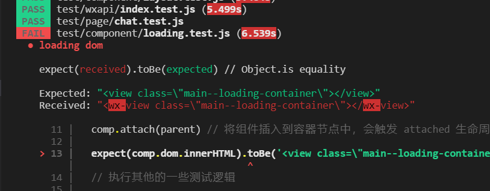
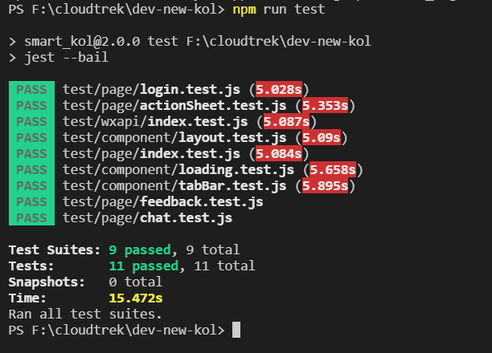
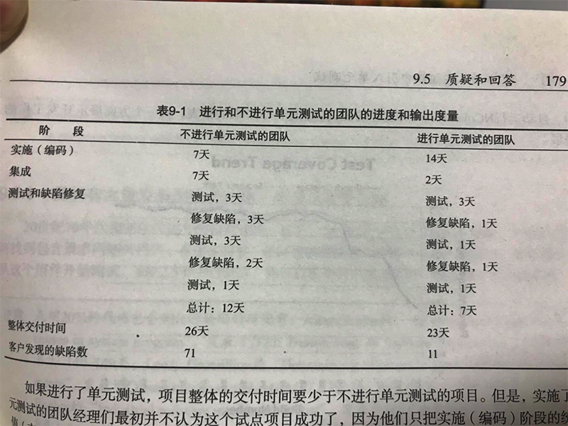

title: 小程序单元测试
speaker: 丁锐
url: http://lihua1108.com
prismTheme: solarizedlight
plugins:
    - echarts

<slide class="light-black-blue aligncenter" image="">

# 微信小程序单元测试 {.text-landing.text-shadow}

丁锐 2019-11-22 {.text-intro}

<!-- [:fa-github: Github](https://github.com/ksky521/nodeppt){.button.ghost} -->

<slide class="aligncenter" data-transition="vertical3d">

#### 分享大纲

- 单元测试的概念及它的好处？
- 当下遇到什么问题？为什么我们需要引入它？
- 如何在小程序中编写测试单元及示例；
- 总结


<slide class="light-back" :class="size-50">

####  一. 单元测试的概念及它的优缺点？

##### 概念：单元测试是用来对一个模块、一个函数或者一个类来进行正确性检验的测试工作。

##### 测试分三步：

  * setup。创建测试对象或模块
  * 执行操作。一般是调用你要测试的那个方法，获得运行结果
  * 验证结果。验证得到的结果跟预期中是一样的


<slide class="light-back" :class="size-50">
#### 优缺点
<html>
    <table style="margin-left: auto; margin-right: auto;">
        <tr>
            <td>
                优点：<br />
                1. 帮助开发人员编写代码，提升质量、减少bug<br />
                2. 提升反馈速度，减少重复工作，提高开发效率<br />
                3. 保证你最后的代码修改不会破坏之前代码的功能<br />
                4. 让代码维护更容易<br />
                5. 有助于改进代码质量和设计<br />
                6. 降低软件开发成本<br />
                正常项目: 软件成本=开发成本（20%）+ 维护成本（30%）+ 异常成本（50%）<br />
                加入了单元测试: 软件成本=开发成本（20%）+ 单元测试成本（10%）+ 维护成本（10%）+ 异常成本（10%） <br/>
                ...
            </td>
            <td>
                缺点：<br />
                1. 需要单独mock测试API及数据，测试复杂<br />
                2. 编写单元测试会增加工作量，耗用开发时长<br />
                3. 推广和运用单元测试需要比较大的投入<br />
                4. 目前不支持TypeScript<br />
                ...
            </td>
        </tr>
    </table>
</html>


<slide class="light-back" :class="size-50">

#### 当下遇到什么问题？为什么我们需要引入它？

* 当前发行版导致之前的已优化样式没有复原

* 当前发版的测试数据(写死数据)上线到了正式环境

###### 随着项目的逐渐扩大，功能愈加复杂，对当前功能模块及时编写单元测试案例可以保证我们代码的健壮性和功能的稳定性，在之后的开发不会影响到之前功能，后期维护容易.我们可以测试wxml, json, js, wxss文件。


<slide class="light-back aligncenter" :class="size-50">

#### 如何在小程序中编写测试案例

<slide class="" :class="size-50">

> 目前采用的是小程序官方提供的一套单元测试框架：miniprogram-simulate + jest

> 安装测试环境

```javascript
npm i jest miniprogram-simulate --save-dev

或者

yarn i jest miniprogram-simulate --save-dev
```


<slide class="" :class="size-50">
#### 配置相关文件
```javascript
"scripts": {
    ...
    "test": "jest --bail"
},
  "jest": {
    "testEnvironment": "jsdom",
    "testURL": "https://jest.test",
    "testMatch": [  // 匹配测试文件
      "**/test/*.test.js",
      "**/test/**/*.test.js"
    ],
    "setupFiles": [ // 初始化mock微信API
      "./test/wx.js"
    ],
    ...
  }
```

<slide class="" :class="size-50">
#### mock 相关测试要用到的API

```javascript
export const noop = () => {};
export const isFn = fn => typeof fn === 'function';
let wId = 0;

global['getApp'] = ({...rest}) => {
    const app = ({
        ...rest,
        globalData: {},
        onLaunch: noop,
        onShow: noop,
        onHide: noop,
        onError: noop
    })
    global.app = app;
    return app
};
...

```


<slide class="" :class="size-80">

#### 编写测试案例
```javascript
// 在src/test目录下
/**
 * 测试Page页面
 * feedBack 反馈页测试
*/
const simulate = require('miniprogram-simulate');
const { join } = require('path');

const componentPath = join(__dirname, '../../src/pages/common/feedBack/index');
const componentId = simulate.load(componentPath);

test('feedback page', async () => {
  const comp = simulate.render(componentId)
  expect(comp.data).toEqual({
    pageShow: false,
    goodsList: null
  })
})

```

<slide class="" :class="size-80">

```javascript
/**
 * loading 组件测试
*/
const path = require('path')
const simulate = require('miniprogram-simulate')
const srcPath = path.resolve(__dirname, '../../src')
const componentPath = '/components/loading/loading'
const id = simulate.load(path.join(srcPath, componentPath)) // 加载自定义组件，返回组件 id
test('loading dom', () => {
  const comp = simulate.render(id) // 使用 id 渲染自定义组件，返回组件封装实例
  const parent = document.createElement('parent-wrapper') // 创建容器节点
  comp.attach(parent) // 将组件插入到容器节点中，会触发 attached 生命周期
  // dom 案例检测
  expect(comp.dom.innerHTML).toBe('<wx-view class=\"main--loading-container\"></wx-view>')
  comp.detach() // 将组件从容器节点中移除，会触发 detached 生命周期
})

// 组件props 检测
test('loading props', () => {
  const comp = simulate.render(id, {
    isShow: true,
  })
  ...
})

```

<slide class="" :class="size-50">

#### 微信API测试

```javascript

test('wx.getSystemInfo', async () => {
  wx.getSystemInfo({
    success(res) {
      expect(res.errMsg).toBe('getSystemInfo:ok')
    },
    complete(res) {
      expect(res.errMsg).toBe('getSystemInfo:ok')
    }
  })
})

```

<slide class="" :class="size-50">

#### 运行单元测试

```javascript
npm run test
```

> 运行结果

* 测试不通过



<slide class="" :class="size-50">

* 测试通过




<slide class="" :class="size-50">

#### 总结




<slide class="" :class="size-50">

> 应该在可能会出错的地方和边界情况编写单元测试。 另外，单元测试应该跟着缺陷报告走， 在修补* 缺陷之前编写好单元测试。这样就会对代码充满自信： 一是bug已经修补， 二是bug不会重现。

###### 相关文档
* [miniprogram-simulate](https://github.com/wechat-miniprogram/miniprogram-simulate)
* [Jest接口API](https://jestjs.io/docs/zh-Hans/next/api)

<slide class="aligncenter" :class="size-50">

## Thanks


